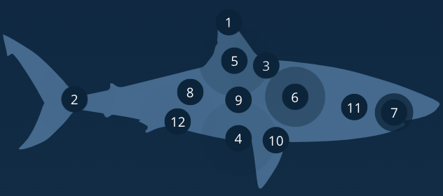

# Procesverslag
Markdown is een simpele manier om HTML te schrijven.  
Markdown cheat cheet: [Hulp bij het schrijven van Markdown](https://github.com/adam-p/markdown-here/wiki/Markdown-Cheatsheet).

Nb. De standaardstructuur en de spartaanse opmaak van de README.md zijn helemaal prima. Het gaat om de inhoud van je procesverslag. Besteedt de tijd voor pracht en praal aan je website.

Nb. Door *open* toe te voegen aan een *details* element kun je deze standaard open zetten. Fijn om dat steeds voor de relevante stuk(ken) te doen.

## Jij

  
uitwerken voor kick-off werkgroep

  ### Auteur:
  Laura van der Gragt

  #### Je startniveau:
  Rode / zwarte piste

  #### Je focus:
  Focussen op surface plane
 

## Je website

  
uitwerken voor kick-off werkgroep

  ### Je opdracht:
  Ideeën voor websites:
  - Apple
  - DLO
  - Ford
  - Daniel Gibbs
  - Ocearch
    
https://www.ocearch.org/science/ 

  #### Screenshot(s) van de eerste pagina (small screen): 
  Ocearch Science 
  

  #### Screenshot(s) van de tweede pagina (small screen):
 Ocearch Shop
  
 

## Toegankelijkheidstest 1/2 (week 1)

  
uitwerken na test in 2e werkgroep

  ### Bevindingen
  Lijst met je bevindingen die in de test naar voren kwamen:
  - geen gebruik gemaakt van headings
  - veel gebruik gemaakt van divs
  - geen unieke titels
  - geen unieke buttons, a's en labels -> geen goede alts gebruikt
  - geen goede visuele focus stijl
  - gebruiken niet echt list elementen, vooral div's
  - sommige normale tekst lijkt op links, maar zijn geen links?
  - voor buttons soms ook a'tjes gebruikt
  - skip link heeft geen nut in de situatie dat hij gebruikt is

## Breakdownschets (week 1)

  
uitwerken na afloop 3e werkgroep

  ### de hele pagina: 
  

  ### dynamisch deel (bijv menu): 
  

  ### wellicht nog een dynamisch deel (bijv filter): 
  

## Voortgang 1 (week 2)

  
uitwerken voor 1e voortgang

  ### Stand van zaken
  Het bedenken hoe ik de haai wilde maken was iets moeilijker, maar met behulp van Sanne bleef ik toch op de goede richting

  ### Agenda voor meeting
  samen met je groepje opstellen

  | Laura      | Lisa          | Sander    | Kayane        |
  | ---            | ---                | ---          | ---              |
  | de 3 verschillende buttons die allemaal weer hun eigen stijlen hebben  | Nav bar            |Margin en padding    | en dan ik dat    |
  | de haai met de nummers | Foto knop slide | Semantisch correct? | dit wil ik zeker |
  | ...            | ...                | ...          | ...              |

  ### Verslag van meeting
  hier na afloop snel de uitkomsten van de meeting vastleggen

  - De foto's goed linken etc. met ./

## Voortgang 2 (week 3)

  
uitwerken voor 2e voortgang

  ### Stand van zaken
  hier dit ging goed & dit was lastig (neem ook screenshots op van delen van je website en code)

  ### Agenda voor meeting
  samen met je groepje opstellen

  | Laura      | student 2          | student 3    | student 4        |
  | ---            | ---                | ---          | ---              |
  | De achtergrond en afbeelding bij de h1  | en dit             | en ik dit    | en dan ik dat    |
  | iframe stylen | dit als er tijd is | nog een punt | dit wil ik zeker |
  | FAQ li tekst weergeven met knop maar wel te lezen voor screenreaders            | ...                | ...          | ...              |

  ### Verslag van meeting
  hier na afloop snel de uitkomsten van de meeting vastleggen

  - goede feedback en hulp gekregen over de vragen die ik had
- ...

## Toegankelijkheidstest 2/2 (week 4)

  
uitwerken na test in 9e werkgroep

  ### Bevindingen
  Lijst met je bevindingen die in de test naar voren kwamen (geef ook aan wat er verbeterd is):
  - ik ben bij sommige images en links de alt tekst vergeten, wat ik nog moet doen
  - ik heb unieke titels gebruikt en valide code geschreven
  - focus stijl toegevoegd
  - tijdens het testen kwam ik erachter dat de header wel iets groter mocht, zoals de buttons
  - ik heb headings grbuikt op de goede volgorde en geen divs
  - wat lijsten zijn heb ik ook list elementen voor gebruikt
  - links die op links lijken en buttons die op buttons lijken
  - de reduced-motion moet wel nog gedaan worden

## Voortgang 3 (week 4)

  
uitwerken voor 3e voortgang

  ### Stand van zaken
  hier dit ging goed & dit was lastig (neem ook screenshots op van delen van je website en code)

  ### Agenda voor meeting
  samen met je groepje opstellen

  | student 1      | student 2          | student 3    | student 4        |
  | ---            | ---                | ---          | ---              |
  | de achtergrond foto opacity verlagen zonder de tekst  | en dit             | en ik dit    | en dan ik dat    |
  | de search bar | dit als er tijd is | nog een punt | dit wil ik zeker |
  | ...            | ...                | ...          | ...              |

  ### Verslag van meeting
  hier na afloop snel de uitkomsten van de meeting vastleggen

  - of een divje om de achtergrond te vervagen of de foto in photoshop zelf aanpassen
  - met translateY kan de search bar van boven komen
  - nog een punt
  - ...

## Eindgesprek (week 5)

  
uitwerken voor eindgesprek

  ### Je uitkomst - karakteristiek screenshots:
  

  ### Dit ging goed/Heb ik geleerd: 
  Ik vond het leren van de custom properties enorm handig, en er zijn nog zo veel mogelijkheden die nog onbekend voor mij zijn. De verschillende modes maken, inclusief een custom theme, was ook iets wat ik wilde leren en wat goed ging na wat trial en error.

  

  ### Dit was lastig/Is niet gelukt:
  Ik wilde ook nog een groter contrast uitwerken, maar ik had er niet heel veel tijd meer voor en wilde het niet gaan afraffelen, waardoor ik ervoor had gekozen om maar een christmas theme te maken, waar niet heel veel onderzoek voor nodig was, behalve het laten werken met JavaScript.

  

  ### Dit kon ik nog verbeteren als ik meer tijd had:
  Als ik meer tijd had gehad zou ik bijvoorbeeld bij de haai de informatie van de popup in de eerste li's zetten ipv een apart lijst van maken die je daarna weer oproep.

  Ook zou ik de christmas-mode nog meer willen uitwerken. Op het moment vind ik het ook wel leuk, maar als ik meer tijd had gehad zou ik echt extra extra willen doen.

  Zelf vond ik ook de light-mode versie niet heel mooi qua kleuren, dus daar zou ik dan ook een mooier pallet voor willen maken, maar voor nu werkt alles wel, wat ik het belangrijkst vond.

## Bronnenlijst

  
continu bijhouden terwijl je werkt

  Nb. Wees specifiek ('css-tricks' als bron is bijv. niet specifiek genoeg). 
  Nb. ChatGpT en andere AI horen er ook bij.
  Nb. Vermeld de bronnen ook in je code.

  1. https://codepen.io/rampen/pen/NbEeyG de sneeuw bij christmas mode
  2. ChatGpT een klein beetje hulp voor het linken van de christmas mode met de radio button en waar
  3. ...

